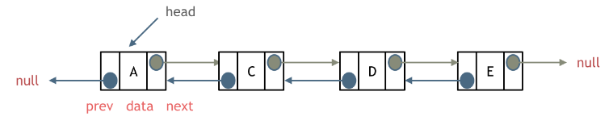
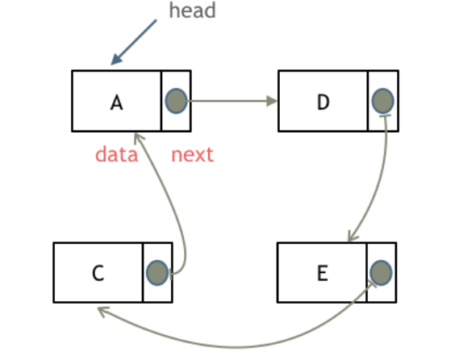

### 什么是链表？

链表是一种通过指针串联在一起的线性结构，每一个节点由两部分组成，一个是数据域，一个是指针域（存放指向下一个结点的指针），最后一个节点的指针指向Null（空指针）。

如图所示：


### 单链表

上图就是单链表

### 双链表

单链表中的指针域只能指向节点的下一个节点。

双链表：每一个节点有两个指针域，一个指向下一个节点，一个指向上一个节点。

双链表 既可以向前查询也可以向后查询。

如图所示：



### 循环链表

循环链表，顾名思义，就是首尾相连的链表。循环链表可以用来解决约瑟夫环问题。

如图所示：



### 数组、链表性能分析


数组在定义的时候，长度就是固定的，如果想改动数组的长度，就需要重新定义一个新的数组。

链表的长度可以是不固定的，并且可以动态增删， 适合数据量不固定，频繁增删，较少查询的场景。


#### 题目1：[203. 移除链表元素](https://leetcode.cn/problems/remove-linked-list-elements/description/)

代码：
```python
# Definition for singly-linked list.
# class ListNode:
#     def __init__(self, val=0, next=None):
#         self.val = val
#         self.next = next
class Solution:
    def removeElements(self, head: Optional[ListNode], val: int) -> Optional[ListNode]:
        if not head:
            return head
        
        dummy = ListNode(next=head)
        slow, fast = dummy, dummy.next
        while fast:
            if fast.val == val:
                slow.next = fast.next
            else:
                slow = slow.next
            
            fast = fast.next
        
        return dummy.next
```


#### 题目2：[]()